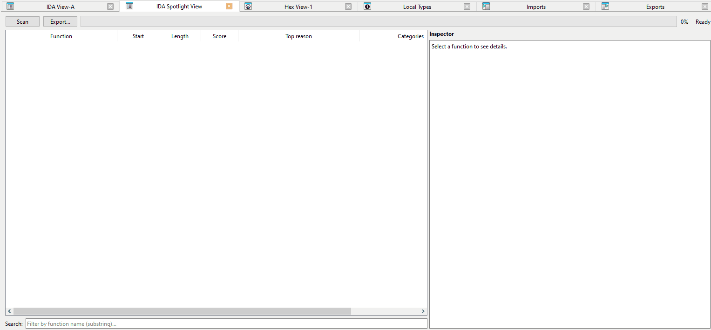
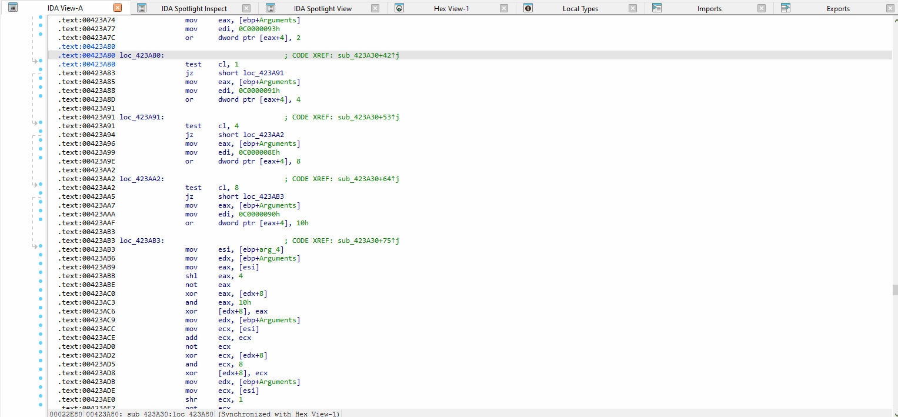
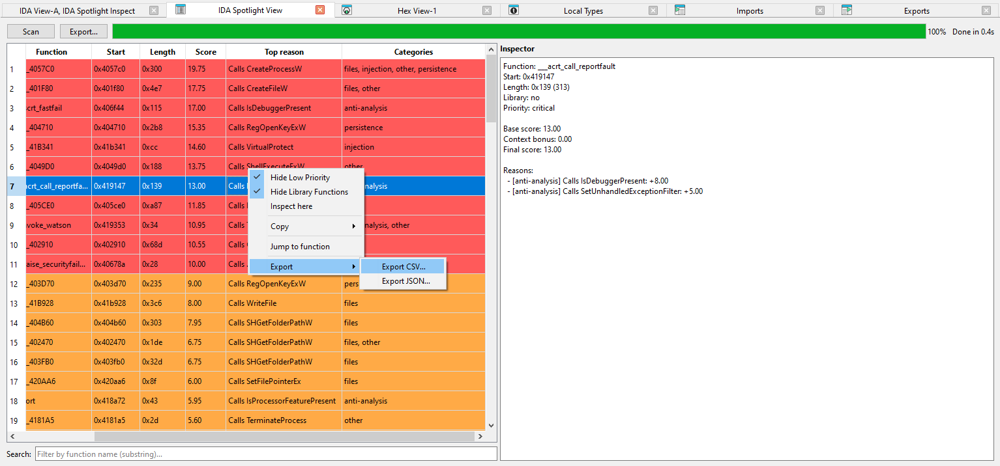
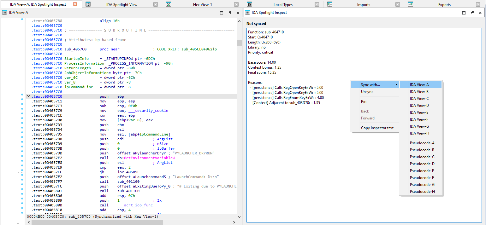

# 🔦 IDA Spotlight

> **Triage 1000s of functions in seconds, not hours.**

**IDA Spotlight** is an intelligent function triage plugin for IDA Pro that helps malware analysts and reverse engineers quickly identify high-value functions in large binaries using configurable signal patterns and historical sample correlation.

[](https://hex-rays.com/)
[](https://www.apache.org/licenses/LICENSE-2.0)
[](https://www.python.org/)

---

## 🎯 The Problem

Modern malware samples often contain **thousands of functions**. Reverse engineers spend hours manually scanning through code, trying to identify interesting functions that warrant deeper analysis. This creates a significant bottleneck in malware analysis workflows.

## 💡 The Solution

IDA Spotlight automatically **scores and prioritizes functions** based on:

- **API calls** — Detects calls to suspicious APIs (networking, injection, persistence, crypto)
- **String references** — Matches strings against known malicious patterns (URLs, registry keys, commands)
- **Context relationships** — Boosts functions that call other high-scoring functions
- **Historical correlation** — Links current sample to previously analyzed IDBs

Instead of manually reviewing 5,000+ functions, analysts can focus on the **top 50 that matter**.

---

## ✨ Key Features

### 📊 Smart Function Scoring

Functions are scored across **7 signal categories**:

| Category | Example Signals |
|----------|----------------|
| **Networking** | `WSAStartup`, `InternetOpenUrl`, `curl_easy_perform`, HTTP headers |
| **Persistence** | `RegSetValueEx`, `CreateService`, registry Run keys, schtasks |
| **Injection** | `VirtualAllocEx`, `WriteProcessMemory`, `CreateRemoteThread`, shellcode patterns |
| **Crypto** | `CryptEncrypt`, `BCryptDecrypt`, `CryptProtectData`, AES/RSA strings |
| **Anti-Analysis** | `IsDebuggerPresent`, `NtQueryInformationProcess`, sandbox detection |
| **Files** | `CreateFile`, `DeleteFile`, shadow copy deletion, ransomware markers |
| **Other** | Privilege escalation, clipboard access, process enumeration |

Each signal has a configurable **weight** (1-10) that contributes to the final score.

### 🚦 Priority Tiers

Functions are automatically classified into priority tiers:

- 🔴 **Critical** — Top 10% of scored functions (immediate attention)
- 🟠 **High** — Top 30% of scored functions (review soon)
- 🟡 **Medium** — Remaining scored functions (worth checking)
- ⚪ **Low** — No signals detected

### 📚 Library Function Awareness

- Detects library functions using IDA's **FLIRT** signatures
- Library functions are **automatically deprioritized**
- Priority tiers are calculated **only for non-library code**
- Visual distinction with colored rows

### 🔗 Context Bonus

Functions that **call high-scoring functions** receive a context bonus:

```
final_score = base_score + (best_callee_score × 0.15)
```

This ensures wrapper functions and orchestration code don't get lost.

### 💾 Knowledge Base (KB)

IDA Spotlight maintains a **SQLite knowledge base** of previously analyzed samples. When you scan a new binary, it correlates against historical data using:

- **Import fingerprints** — MD5 of normalized import list
- **Import function overlap** — Shared imported APIs
- **Section name profiles** — Unusual section patterns
- **Function name matching** — User-defined function names

This enables rapid identification of **related samples** and **malware families**.

### 🖥️ Dual-View Workflow

**IDA Spotlight View** — Main results table
- Sortable columns (Function, Score, Priority, Categories)
- Search filtering by function name
- Toggle visibility of low-priority and library functions
- Context menu with copy, jump, and export actions

**IDA Spotlight Quick Inspector** — Synchronized detail panel
- Syncs with `IDA View-A/B/C` or `Pseudocode-A/B/C`
- Follows cursor movement like native IDA subviews
- Shows full score breakdown with reasons
- Back/Forward navigation history
- Pin to freeze current function

### 📤 Export & Reporting

Export results for external tools and reports:

- **CSV** — For spreadsheets and data analysis
- **JSON** — For automation and integration

Exports include: function name, address, length, score, priority, library flag, top reason, and all categories.

---

## 🚀 Quick Start

### Installation

1. Copy the plugin directory to your IDA plugins folder:
   ```
   %APPDATA%\Hex-Rays\IDA Pro\plugins\ida-spotlight\
   ```

2. Ensure all files are present:
   ```
   ida-spotlight/
   ├── spotlight.py            # Main plugin entry point
   ├── spotlight_actions.py    # IDA action handlers
   ├── spotlight_config.py     # Configuration and constants
   ├── spotlight_kb.py         # Knowledge base operations
   ├── spotlight_kb_index.py   # KB indexing
   ├── spotlight_scanner.py    # Function scanning and scoring
   ├── spotlight_ui.py         # PySide6 UI components
   ├── spotlight_utils.py      # Utility functions
   ├── spotlight.json          # Signal patterns config
   └── ida-plugin.json         # IDA metadata
   ```

3. Launch IDA Pro 9.2+

### Usage

1. Open a binary in IDA Pro
2. Navigate to: `View → Open subviews → IDA Spotlight → IDA Spotlight View`
3. Click **Scan** to analyze all functions
4. Review results sorted by score
5. Double-click or press Enter to jump to a function
6. Right-click for context menu options

### Keyboard Shortcuts

| Action | Description |
|--------|-------------|
| `Enter` | Jump to selected function |
| `Double-click` | Jump to selected function |

---

## ⚙️ Configuration

### Signal Patterns (`spotlight.json`)

Customize scoring rules by editing `spotlight.json`:

```json
{
  "signals": {
    "networking": {
      "functions": {
        "WSAStartup": 2,
        "connect": 6,
        "InternetOpenUrlA": 6
      },
      "strings": {
        "https?://": 8,
        "User-Agent:": 5
      }
    }
  }
}
```

- **functions** — Maps API names to weights
- **strings** — Maps regex patterns to weights

### Filters

Exclude noise from analysis:

```json
{
  "filters": {
    "functions": ["^sub_[0-9a-fA-F]+$"],
    "sections": [".text", ".data", ".rdata"],
    "dlls": ["kernel32.dll", "ntdll.dll"]
  }
}
```

### Scoring Parameters

Fine-tune scoring behavior:

```json
{
  "context_bonus_factor": 0.15,
  "library_score_penalty": 3.0
}
```

---

## 📋 Requirements

- **IDA Pro** 9.2 or later
- **Python** 3.x (bundled with IDA)
- **PySide6** and **shiboken6** (auto-installed by IDA or via pip)
- **Windows** x86_64 (primary platform)

---

## 🏗️ Architecture

```
spotlight.py              # Plugin entry point
├── spotlight_config.py   # Configuration and constants
├── spotlight_utils.py    # Utility functions
├── spotlight_scanner.py  # Function scanning and scoring
├── spotlight_ui.py       # PySide6 UI components
├── spotlight_actions.py  # IDA action handlers
├── spotlight_kb.py       # Knowledge base operations
└── spotlight_kb_index.py # KB batch indexing script
```

---

## 🤝 Use Cases

### Malware Triage
> "I have 300 samples to analyze this week. IDA Spotlight helps me identify the 10 functions worth reversing in each sample."

### Threat Intelligence
> "When I find a new sample, Spotlight correlates it with our historical KB to identify malware family relationships."

### Vulnerability Research
> "Quickly locate functions handling network input, file operations, or crypto — the most likely targets for vulnerabilities."

### CTF Competitions
> "During time-limited competitions, Spotlight immediately highlights interesting functions instead of manual searching."

---

## 📈 Roadmap

- [ ] Cross-platform support (macOS, Linux)
- [ ] Yara rule generation from high-scoring functions
- [ ] Team KB sharing via remote database
- [ ] Machine learning-based signal suggestions
- [ ] Integration with threat intelligence feeds

---

## Animation




---

## Screenshots




---


## 👤 Author

**Askar Dyussekeyev**  
📧 dyussekeyev@yandex.kz  
🔗 [github.com/dyussekeyev](https://github.com/dyussekeyev)

---

## 📄 License

This project is licensed under the **Apache License 2.0** — see the full license text at [apache.org/licenses/LICENSE-2.0](https://www.apache.org/licenses/LICENSE-2.0).

---

## 🙏 Acknowledgments

- **Hex-Rays** for IDA Pro and the IDAPython API
- The reverse engineering community for inspiring signal patterns
- All malware analysts who shared their workflows and pain points

---

<p align="center">
  <b>⭐ Star this repository if IDA Spotlight helps your workflow! ⭐</b>
</p>
